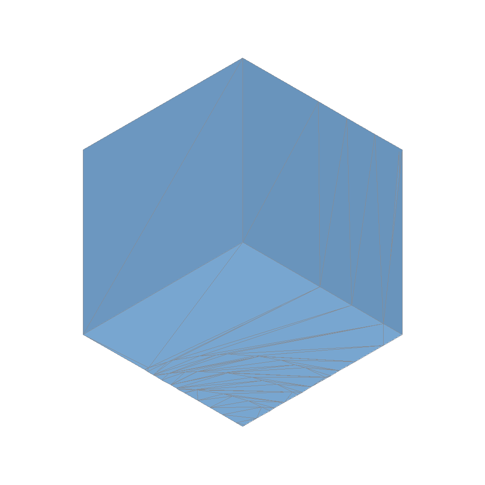
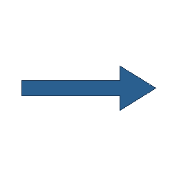
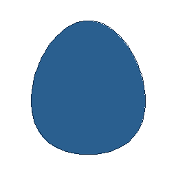
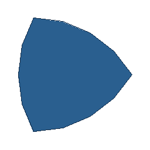
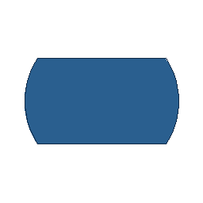
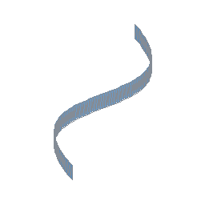
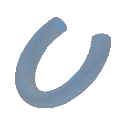

# csgrs

A fast, optionally multithreaded **Constructive Solid Geometry (CSG)**
library in Rust, built around Boolean operations (*union*, *difference*,
*intersection*, *xor*) on several different internal geometry representations.
**csgrs** provides data structures and methods for constructing 2D and 3D geometry
with an [OpenSCAD](https://openscad.org/)-like syntax. It integrates with the
Hyper geometry crates for exact-aware planar regions, curves, triangulation,
mesh topology, and physical-property calculations. Core geometry uses
`hyperreal::Real`; primitive floats are confined to IO, JavaScript, FFI, and
adapter boundaries. The crate is pure Rust and can be built for WASM.

Polygon triangulation uses [hypertri](../hypertri/README.md): **csgrs** rotates
3D polygons into 2D, lifts projected coordinates to hyperreals, runs exact
predicate triangulation, then maps triangle indices back onto the original 3D
vertices. Applications that want an `f32`, `f64`, or `i128` API can use the
[primitive scalar adapters](adapters/README.md).


## Community
[](https://discord.gg/9WkD3WFxMC)

## Getting started

### A simple CSG example

Install the [Rust](https://www.rust-lang.org/) language tools from
[rustup.rs](https://rustup.rs/).

Use cargo to create a new project, `my_cad_project`, and add the `csgrs` dependency:
```shell
cargo new my_cad_project
cd my_cad_project
cargo add csgrs
```

### main.rs

Change `src/main.rs` to the following code:
```rust
use csgrs::csg::CSG;
use csgrs::Real;

type Mesh = csgrs::mesh::Mesh<()>;

fn main() -> Result<(), Box<dyn std::error::Error>> {
    // Create a cube
    let cube: Mesh = Mesh::cube(Real::from(2), ());

    // Create sphere at (1, 1, 1) with radius 1.25:
    let radius = (Real::from(5) / Real::from(4)).unwrap();
    let sphere = Mesh::sphere(radius, 16, 8, ())
        .translate(Real::one(), Real::one(), Real::one());

    // Perform a difference operation:
    let result = cube.try_difference(&sphere)?;

    // Write the result as an ASCII STL:
    let stl = result.to_stl_ascii("cube_minus_sphere")?;
    std::fs::write("cube_sphere_difference.stl", stl)?;
    Ok(())
}
```

### Build and run

```shell
cargo build
cargo run
```

This results in a file named `cube_sphere_difference.stl` in the current directory
and it can be viewed in a STL viewer such as [f3d](https://github.com/f3d-app/f3d)
with, `f3d cube_sphere_difference.stl`, and should look like this:


### Building for WASM

```shell
cargo install wasm-pack
wasm-pack build --release --target bundler --out-dir pkg -- --features wasm
```

## Features and Structures

### Profile Structure

- **`Profile`** stores planar CAD geometry as native Hypercurve topology:
  - a `hypercurve::Region2` for filled material and hole contours,
  - `hypercurve::CurveString2` values for open wires, and
  - finite projections used only at IO and display boundaries.

Use `Profile::from_region`, `Profile::from_wires`, or
`Profile::from_region_and_wires` to construct profiles without flattening their
topology. Profiles carry geometry only; callers provide face metadata when
creating a mesh. Hypertri triangulates profiles for mesh conversion and export.

### 2D Shapes in Profile

-  **`Profile::square(width: Real)`**
-  **`Profile::rectangle(width: Real, length: Real)`**
-  **`Profile::circle(radius: Real, segments: usize)`**
-  **`Profile::polygon(&[[x1,y1],[x2,y2],...])`**
-  **`Profile::rounded_rectangle(width: Real, height: Real, corner_radius: Real, corner_segments: usize)`**
-  **`Profile::ellipse(width: Real, height: Real, segments: usize)`**
-  **`Profile::regular_ngon(sides: usize, radius: Real)`**
-  **`Profile::arrow(shaft_length: Real, shaft_width: Real, head_length: Real, head_width: Real)`**
-  **`Profile::right_triangle(width: Real, height: Real)`**
-  **`Profile::trapezoid(top_width: Real, bottom_width: Real, height: Real, top_offset: Real)`**
-  **`Profile::star(num_points: usize, outer_radius: Real, inner_radius: Real)`**
-  **`Profile::teardrop(width: Real, height: Real, segments: usize)`**
-  **`Profile::egg(width: Real, length: Real, segments: usize)`**
-  **`Profile::squircle(width: Real, height: Real, segments: usize)`**
-  **`Profile::keyhole(circle_radius: Real, handle_width: Real, handle_height: Real, segments: usize)`**
-  **`Profile::reuleaux(sides: usize, radius: Real, arc_segments_per_side: usize)`**
-  **`Profile::ring(id: Real, thickness: Real, segments: usize)`**
-  **`Profile::pie_slice(radius: Real, start_angle_deg: Real, end_angle_deg: Real, segments: usize)`**
-  **`Profile::supershape(a: Real, b: Real, m: Real, n1: Real, n2: Real, n3: Real, segments: usize)`**
-  **`Profile::circle_with_keyway(radius: Real, segments: usize, key_width: Real, key_depth: Real)`**
-  **`Profile::circle_with_flat(radius: Real, segments: usize, flat_dist: Real)`**
-  **`Profile::circle_with_two_flats(radius: Real, segments: usize, flat_dist: Real)`**
-  **`Profile::from_image(img: &GrayImage, threshold: u8, closepaths: bool)`** - Builds a new CSG from the “on” pixels of a grayscale image
-  **`Profile::text(text: &str, font_data: &[u8], size: Real)`** - generate 2D text geometry in the XY plane from TTF fonts
-  **`Profile::metaballs(balls: &[(hyperlattice::Point2, Real)], resolution: (usize, usize), iso_value: Real, padding: Real)`**
-  **`Profile::airfoil_naca4(max_camber: Real, camber_position: Real, thickness: Real, chord: Real, samples: usize)`** - [NACA 4 digit](https://en.wikipedia.org/wiki/NACA_airfoil#Four-digit_series) airfoil
-  **`Profile::bezier(control: &[[Real; 2]], segments: usize)`**
-  **`Profile::bspline(control: &[[Real; 2]], p: usize, segments_per_span: usize)`**
-  **`Profile::heart(width: Real, height: Real, segments: usize)`**
-  **`Profile::crescent(outer_r: Real, inner_r: Real, offset: Real, segments: usize)`** -
-  **`profile.hilbert_curve(order: usize, padding: Real)`** - create a Hilbert path clipped to an existing profile
-  **`Profile::involute_gear(module: Real, teeth: usize, pressure_angle_deg: Real, clearance: Real, backlash: Real, segments_per_flank: usize)`**
- **`Profile::cycloidal_gear(module_: Real, teeth: usize, generating_radius: Real, clearance: Real, segments_per_flank: usize)`**
- **`Profile::involute_rack(module_: Real, num_teeth: usize, pressure_angle_deg: Real, clearance: Real, backlash: Real)`**
- **`Profile::cycloidal_rack(module_: Real, num_teeth: usize, clearance: Real, segments_per_flank: usize)`**

```rust
use csgrs::profile::Profile;
use csgrs::Real;

let square = Profile::square(Real::one());
let rect = Profile::rectangle(Real::from(2), Real::from(4));
let circle = Profile::circle(Real::one(), 32);
let circle2 = Profile::circle(Real::from(2), 64);

let font_data = include_bytes!("../fonts/MyFont.ttf");
let profile_text = Profile::text("Hello!", font_data, Real::from(20));

// Then extrude the text to make it 3D:
let text_3d = profile_text.extrude(Real::one(), ());
```

### Extrusions and Revolves

Extrusions build 3D polygons from 2D Geometries.

-  **`Profile::extrude(height: Real, metadata: M)`** - Simple extrude in Z+
-  **`Profile::extrude_vector(direction: Vector3, metadata: M)`** - Extrude along a direction
-  **`Profile::revolve(angle_degs, segments, metadata: M)`** - Extrude while rotating around the Y axis
- **`Profile::extrude_twisted(height, twist_degrees, [scale_x, scale_y], slices, metadata)`** - Build a connected twisted or tapered extrusion
- **`Profile::loft(&sections)`** - Loft through corresponding closed polygon sections
-  **`Profile::sweep(path: &[Point3<Real>], metadata: M)`** - Sweep a Profile along a 3D path

```rust
let square = Profile::square(Real::from(2));
let prism = square.extrude(Real::from(5), ());
let revolve_shape = square.revolve(Real::from(360), 16, ())?;
```

### Misc Profile operations

- **`Profile::offset(distance)`** - certified sharp offset through Hypercurve; remaining regularized cases require the optional `offset` feature.
- **`Profile::offset_rounded(distance)`** - rounded offset behind the optional `offset` feature.
- **`Profile::straight_skeleton(orientation)`** - inside or outside skeleton behind the optional `offset` feature.
- **`Profile::bounding_box()`** - computes the bounding box of the shape.
- **`Profile::invalidate_bounding_box()`** - invalidates the bounding box of the shape, causing it to be recomputed on next access
- **`Profile::triangulate()`** - subdivides the Profile into triangles

### Mesh Structure

- **`Mesh<M>`** stores and manipulates 3D polygonal geometry. It contains:
  - a `Vec<Polygon<M>>`; each polygon holds:
    - a `Vec<Vertex>` (positions + normals),
    - a `Plane` describing the polygon’s orientation in 3D.
    - a lazily cached bounding box, and
    - one metadata value of type `M`.
  - lazily cached mesh bounds and reusable connectivity/query state.

`Mesh<M>` provides methods for working with 3D shapes. Build one from polygons
with `Mesh::from_polygons(...)`.
Polygons must be closed, planar, and have 3 or more vertices.
Metadata belongs exclusively to polygons. Boolean operations preserve source
face metadata through Hypermesh provenance; operations that create unrelated
faces require an explicit metadata value.

### 3D Shapes in Mesh

-  **`Mesh::cube(width: Real, metadata: M)`**
-  **`Mesh::cuboid(width: Real, length: Real, height: Real, metadata: M)`**
-  **`Mesh::sphere(radius: Real, segments: usize, stacks: usize, metadata: M)`**
-  **`Mesh::cylinder(radius: Real, height: Real, segments: usize, metadata: M)`**
-  **`Mesh::frustum(radius1: Real, radius2: Real, height: Real, segments: usize, metadata: M)`** -
Construct a frustum at origin with height and `radius1` and `radius2`.
An exactly zero radius constructs a cone terminating at a point.
-  **`Mesh::frustum_ptp(start: Point3, end: Point3, radius1: Real, radius2: Real, segments:
usize, metadata: M)`** -
Construct a frustum from `start` to `end` with `radius1` and `radius2`.
An exactly zero radius constructs a cone terminating at a point.
-  **`Mesh::polyhedron(points: &[[Real; 3]], faces: &[Vec<usize>], metadata: M)`**
-  **`Mesh::octahedron(radius: Real, metadata: M)`** -
-  **`Mesh::icosahedron(radius: Real, metadata: M)`** -
-  **`Mesh::torus(major_r: Real, minor_r: Real, segments_major: usize, segments_minor: usize, metadata: M)`** -
-  **`Mesh::egg(width: Real, length: Real, revolve_segments: usize, outline_segments: usize, metadata: M)`**
-  **`Mesh::teardrop(width: Real, height: Real, revolve_segments: usize, shape_segments: usize, metadata: M)`**
-  **`Mesh::teardrop_cylinder(width: Real, length: Real, height: Real, shape_segments: usize, metadata: M)`**
-  **`Mesh::ellipsoid(rx: Real, ry: Real, rz: Real, segments: usize, stacks: usize, metadata: M)`**
-  **`Mesh::metaballs(balls: &[MetaBall], resolution: (usize, usize, usize), iso_value: Real, padding: Real, metadata: M)`**
-  **`Mesh::sdf<F>(sdf: F, resolution: (usize, usize, usize), min_pt: Point3, max_pt: Point3, iso_value: Real, metadata: M)`** - Mesh a signed-distance field inside a bounding box
-  **`Mesh::arrow(start: Point3, direction: Vector3, segments: usize, orientation: bool, metadata: M)`** - Create an arrow at `start`, pointing along `direction`
-  **`Mesh::gyroid_solid(resolution, period, iso_value, thickness, metadata)`** - Generate a capped finite-thickness Gyroid solid
-  **`Mesh::schwarz_p_solid(resolution, period, iso_value, thickness, metadata)`** - Generate a capped finite-thickness Schwarz P solid
-  **`Mesh::schwarz_d_solid(resolution, period, iso_value, thickness, metadata)`** - Generate a capped finite-thickness Schwarz D solid
-  **`Mesh::spur_gear_involute(module: Real, teeth: usize, pressure_angle_deg: Real, clearance: Real, backlash: Real, segments_per_flank: usize, thickness: Real, helix_angle_deg: Real, slices: usize, metadata: M,)`** - Generate an involute spur gear
- **`Mesh::helical_involute_gear(module_: Real, teeth: usize, pressure_angle_deg: Real, clearance: Real, backlash: Real, segments_per_flank: usize, thickness: Real, helix_angle_deg: Real, slices: usize, metadata: M)`** - Generate a helical involute gear

```rust
// Unit cube at origin, no metadata
let cube = Mesh::cube(1.0, ());

// Sphere of radius=2 at origin with 32 segments and 16 stacks
let sphere = Mesh::sphere(2.0, 32, 16, ());

// Cylinder from radius=1, height=2, 16 segments, and no metadata
let cyl = Mesh::cylinder(1.0, 2.0, 16, ());

// Create a custom polyhedron from points and face indices:
let points = &[
    [0.0, 0.0, 0.0],
    [1.0, 0.0, 0.0],
    [1.0, 1.0, 0.0],
    [0.0, 1.0, 0.0],
    [0.5, 0.5, 1.0],
];
let faces = vec![
    vec![0, 1, 2, 3], // base rectangle
    vec![0, 1, 4],    // triangular side
    vec![1, 2, 4],
    vec![2, 3, 4],
    vec![3, 0, 4],
];
let pyramid = Mesh::<()>::polyhedron(points, &faces, ());

// Metaballs https://en.wikipedia.org/wiki/Metaballs
use csgrs::mesh::metaballs::MetaBall;
let balls = vec![
    MetaBall::new(Point3::origin(), 1.0),
    MetaBall::new(Point3::new(1.5, 0.0, 0.0), 1.0),
];

let resolution = (60, 60, 60);
let iso_value = 1.0;
let padding = 1.0;

let metaball_csg = Mesh::<()>::metaballs(
    &balls,
    resolution,
    iso_value,
    padding,
    (),
);

// Example Signed Distance Field for a sphere of radius 1.5 centered at (0,0,0)
let my_sdf = |p: &Point3<Real>| p.coords.norm() - 1.5;

let resolution = (60, 60, 60);
let min_pt = Point3::new(-2.0, -2.0, -2.0);
let max_pt = Point3::new( 2.0,  2.0,  2.0);
let iso_value = 0.0; // Typically zero for SDF-based surfaces

let csg_shape = Mesh::<()>::sdf(my_sdf, resolution, min_pt, max_pt, iso_value, ());
```

### CSG Boolean Operations

```rust
let union_result = cube.try_union(&sphere)?;
let difference_result = cube.try_difference(&sphere)?;
let intersection_result = cylinder.try_intersection(&sphere)?;
let xor_result = cylinder.try_xor(&sphere)?;

// When several results are needed for the same pair, retain one certified
// arrangement and reuse its exact subdivision and winding evidence.
let prepared = cube.try_prepare_boolean(&sphere)?;
let union_result = prepared.try_union()?;
let difference_result = prepared.try_difference()?;
let intersection_result = prepared.try_intersection()?;
let xor_result = prepared.try_xor()?;
```

`Mesh<M>` and `Profile` provide typed `try_union`, `try_difference`,
`try_intersection`, and `try_xor` methods. Compatibility methods on
`csgrs::csg::CSG` panic if certification reports an error or uncertainty.
All mesh Boolean methods use the same prepared pipeline. Direct methods request
one operation and retain its operation-specific pruning, while
`Mesh::try_prepare_boolean` retains all four for build-once/extract-many use.
Its borrow ties the preparation to the source meshes, every general extraction
remains closure-certified by HyperMesh, and exact empty/disjoint/identical
shortcuts preserve source metadata and polygonization.

### Transformations

- **`::translate(x: Real, y: Real, z: Real)`** - Returns the CSG translated by x, y, and z
- **`::translate_vector(vector: Vector3)`** - Returns the CSG translated by vector
- **`::rotate(x_deg, y_deg, z_deg)`** - Returns the CSG rotated in x, y, and z
- **`::scale(scale_x, scale_y, scale_z)`** - Returns the CSG scaled in x, y, and z
- **`::mirror(plane: Plane)`** - Returns the CSG mirrored across plane
- **`::center()`** - Returns the CSG centered at the origin
- **`::float()`** - Returns the CSG translated so that its bottommost point(s) sit exactly at z=0
- **`::transform(&Matrix4)`** - Returns the CSG after applying arbitrary affine transforms
-  **`::distribute_arc(count: usize, radius: Real, start_angle_deg: Real, end_angle_deg: Real)`**
-  **`::distribute_linear(count: usize, dir: hyperlattice::Vector3, spacing: Real)`**
-  **`::distribute_grid(rows: usize, cols: usize, dx: Real, dy: Real)`**
-  **`::inverse()`** - flips the inside/outside orientation.

```rust
use hyperlattice::{Real, Vector3};
use csgrs::csg::CSG;
use csgrs::mesh::plane::Plane;

let moved = cube.translate(Real::from(3), Real::zero(), Real::zero());
let moved2 = cube.translate_vector(Vector3::from_xyz(
    Real::from(3),
    Real::zero(),
    Real::zero(),
));
let rotated = sphere.rotate(Real::zero(), Real::from(45), Real::from(90));
let scaled = cylinder.scale(Real::from(2), Real::one(), Real::one());
let plane_x = Plane::from_normal(Vector3::x(), Real::zero());
let mirrored = cube.mirror(plane_x);
```

### Miscellaneous Mesh Operations

- **`Mesh::vertices()`** - collect all vertices from the `Mesh`
-  **`Mesh::convex_hull(metadata)`** - generate a hull using exact Hyperreal orientation predicates.
-  **`Mesh::minkowski_sum(&other, metadata)`** - compute pairwise sums, then take their hull.
- **`Mesh::ray_intersections(origin, direction)`** — returns all intersection points and distances.
- **`Mesh::flatten()`** - flattens a 3D shape into 2D (on the XY plane), unions the outlines.
- **`Mesh::slice(plane)`** - slices the CSG by a plane and returns the cross-section polygons.
-  **`Mesh::subdivide_triangles(subdivisions)`** - subdivides each polygon’s triangles, increasing mesh density.
- **`Mesh::renormalize()`** - re-computes each polygon’s plane from its vertices, resetting all normals.
- **`Mesh::bounding_box()`** - computes the bounding box of the shape.
- **`Mesh::invalidate_bounding_box()`** - invalidates the bounding box of the shape, causing it to be recomputed on next access
- **`Mesh::triangulate()`** - triangulates all polygons returning a CSG containing triangles.
- **`Mesh::from_polygons(polygons: &[Polygon<M>])`** - create a mesh from polygons.

### STL

- **Export ASCII STL**: `mesh.to_stl_ascii("solid_name") -> Result<String, IoError>`
- **Export Binary STL**: `mesh.to_stl_binary("solid_name") -> Result<Vec<u8>, IoError>`
- **Import STL**: `Mesh::from_stl(&stl_data, metadata) -> Result<Mesh<M>, IoError>`

```rust
// Save to ASCII STL
let stl_text = csg_union.to_stl_ascii("union_solid")?;
std::fs::write("union_ascii.stl", stl_text)?;

// Save to binary STL
let stl_bytes = csg_union.to_stl_binary("union_solid")?;
std::fs::write("union_bin.stl", stl_bytes)?;

// Load from an STL file on disk
let file_data = std::fs::read("some_file.stl")?;
let imported_mesh = Mesh::from_stl(&file_data, ())?;
```

### DXF

- **Export**: `mesh.to_dxf() -> Result<Vec<u8>, IoError>`
- **Import**: `Mesh::from_dxf(&dxf_data, metadata) -> Result<Mesh<M>, IoError>`

```rust
// Export DXF
let dxf_bytes = csg_obj.to_dxf()?;
std::fs::write("output.dxf", dxf_bytes)?;

// Import DXF
let dxf_data = std::fs::read("some_file.dxf")?;
let mesh_dxf = Mesh::from_dxf(&dxf_data, ())?;
```

### Hershey Text

Hershey fonts are single stroke fonts which produce open ended polylines in the XY plane via [`hershey`](https://crates.io/crates/hershey):

```rust
fn hershey_text(font: &hershey::Font<'_>) -> Profile {
    Profile::from_hershey("Hello!", font, Real::from(20))
}
```

### Create a Bevy `Mesh`

`csg.to_bevy_mesh()` returns a Bevy [`Mesh`](https://docs.rs/bevy/latest/bevy/prelude/struct.Mesh.html).

```rust
use bevy::{prelude::*, render::render_asset::RenderAssetUsages, render::mesh::{Indices, PrimitiveTopology}};

let bevy_mesh = mesh_obj.to_bevy_mesh();
```

### Create a Parry `TriMesh`

Parry is no longer a core dependency. Use `Mesh::intersect_polyline`,
`Mesh::contains_vertex`, and the triangulated vertex/index views directly, or
convert those buffers in an application-specific adapter.

### Create a Rapier Rigid Body

Rapier integration is intentionally outside the core crate. Applications can
construct a Rapier collider from the mesh's triangulated vertex/index buffers
and use `mass_properties` for exact-aware physical properties.

### Mass Properties

```rust
let density = Real::one();
let (mass, com, inertia_frame) = mesh_obj.mass_properties(density)?;
println!("Mass: {}", mass);
println!("Center of Mass: {:?}", com);
println!("Inertia local frame: {:?}", inertia_frame);
```

### Manifold Check

`mesh.is_manifold()` triangulates the CSG, builds a HashMap of all edges (pairs of vertices), and checks that each is used exactly twice. Returns `true` if manifold, `false` if not.

```rust
if (mesh_obj.is_manifold()){
    println!("Mesh is manifold!");
} else {
    println!("Not manifold.");
}
```

## Tolerance

Primitive `f32` and `f64` values are limited to IO, rendering, JavaScript, FFI,
and adapter boundaries, then promoted into Hyperreal-backed geometry before
topology-sensitive work. There are no Cargo precision flags and no global
floating-point tolerance setter.

## Working with Metadata

`Mesh<M>` is generic over polygon metadata `M: Clone`; `Profile` is not generic
and carries no metadata. Each polygon owns one `M`. Use `M = ()` for no metadata
or `M = Option<YourMetadata>` for optional face metadata. Mesh-level metadata is
deliberately absent, giving Boolean provenance one unambiguous ownership model.

```rust
use csgrs::mesh::Polygon;
use csgrs::vertex::Vertex;
use hyperlattice::{Point3, Vector3};

#[derive(Clone)]
struct MyMetadata {
    color: (u8, u8, u8),
    label: String,
}

type Mesh = csgrs::mesh::Mesh<Option<MyMetadata>>;

// For a single polygon:
let mut poly = Polygon::new(
    vec![
        Vertex::new(Point3::origin(), Vector3::z()),
        Vertex::new(Point3::new(1.0, 0.0, 0.0), Vector3::z()),
        Vertex::new(Point3::new(0.0, 1.0, 0.0), Vector3::z()),
    ],
    Some(MyMetadata {
        color: (255, 0, 0),
        label: "Triangle".into(),
    }),
);

// Retrieve metadata
if let Some(data) = poly.metadata() {
    println!("This polygon is labeled {}", data.label);
}

// Mutate metadata
if let Some(data_mut) = poly.metadata_mut() {
    data_mut.label.push_str("_extended");
}
```

## Examples
- [csgrs-bevy-example](https://github.com/timschmidt/csgrs-bevy-example)
- [csgrs-egui-example](https://github.com/timschmidt/csgrs-egui-example)
- [csgrs-egui-wasm-example](https://github.com/timschmidt/csgrs-egui-wasm-example)
- [csgrs-druid-example](https://github.com/timschmidt/csgrs-druid-example)

## Roadmap

Longer-term directions; the API sections above describe current support.

- **Attachments** Unless you make models containing just one object attachments features can revolutionize your modeling. They will let you position components of a model relative to other components so you don't have to keep track of the positions and orientations of parts of the model. You can instead place something on the TOP of something else, perhaps aligned to the RIGHT.
- **Rounding and filleting** Provide modules like cuboid() to make a cube with any of the edges rounded, offset_sweep() to round the ends of a linear extrusion, and prism_connector() which works with the attachments feature to create filleted prisms between a variety of objects, or even rounded holes through a single object. Also edge_profile() to apply a variety of different mask profiles to chosen edges of a cubic shape, or directly subtract 3d mask shapes from an edge of objects that are not cubes.
- **Complex object support** The path_sweep() function/module takes a 2d polygon moves it through space along a path and sweeps out a 3d shape as it moves. Link together a series of arbitrary polygons with skin() or vnf_vertex_array().  Build parts of an object in multiple different representations and combine.
- **Texturing** Apply textures to many kinds of objects. Create knurling or any repeating pattern.  Applying a texture can actually replace the base object with something different based on repeating copies of the texture element. A texture can also be an image; using texturing you can emboss an arbitrary image onto your model.
- **Parts library** The parts library will include many useful specific functional parts including gears, generic threading, and specific threading to match plastic bottles, pipe fittings, and standard screws. Also clips, hinges, and dovetail joints, aluminum extrusion, bearings, nuts, bolts, washers, etc.
- **Shorthands** Shorthands to make your code a little shorter, and more importantly, make it significantly easier to read. Compare up(x) to translate([0,0,x]). Shorthands will include operations for creating copies of objects and for applying transformations to objects.  Drawing like turtle graphics will be possible.
- **Non-linear solver** Composed of a tree which can contain operations and variables representing systems of equations describing constraints, and functionality to perterb variables, sample the solution space described by the tree expression, determine the local slope, and hill climb toward a solution.

## Performance
Patterns followed throughout the library to improve performance
and memory usage:
- accept borrowed slices where ownership is unnecessary,
- use Rayon where work is independently parallelizable,
- minimize allocation and cloning, and
- retain exact facts, bounds, and topology for reuse across operations.

The retained reference-guided measurements and replay commands are recorded in
[PERFORMANCE.md](PERFORMANCE.md). In particular, renderer buffers stream from
certified polygon triangulation without materializing a throwaway triangle
`Mesh`, and indexed exporters reserve from known topology bounds.
Repeated mesh Booleans can retain one borrowed certified arrangement through
`Mesh::try_prepare_boolean`, while ray queries stream borrowed triangle vertices
without materializing temporary triangle records.

## Todo

This historical investigation backlog is retained with the restored README
layout; it is not a statement of current feature support. The API sections and
the issue tracker are authoritative.

- when triangulating, detect T junctions with other polygons with shared edges,
and insert splitting vertices into polygons to correct
- implement as_indexed, from_indexed, and merge_vertices (using hashbrown, and an expression of each float out to EPSILON significant digits)
- ensure re-triangulate unions all coplanar polygons
- evaluate https://docs.rs/parry3d/latest/parry3d/shape/struct.HalfSpace.html and
https://docs.rs/parry3d/latest/parry3d/query/point/trait.PointQuery.html#method.contains_point
for plane splitting
- evaluate https://docs.rs/parry3d/latest/parry3d/shape/struct.Polyline.html
for Polygon
- evaluate https://docs.rs/parry3d/latest/parry3d/shape/struct.Segment.html
- evaluate https://docs.rs/nalgebra/latest/nalgebra/geometry/struct.Rotation.html#method.rotation_between-1
- evaluate https://docs.rs/parry3d/latest/parry3d/shape/struct.Triangle.html
- evaluate https://docs.rs/parry3d/latest/parry3d/shape/struct.Segment.html#method.local_split_and_get_intersection in plane splitting and slicing
- evaluate https://github.com/dimforge/parry/blob/master/src/query/clip/clip_halfspace_polygon.rs
- evaluate https://github.com/dimforge/parry/blob/master/src/query/clip/clip_segment_segment.rs
- evaluate https://github.com/dimforge/parry/blob/master/src/transformation/voxelization/voxel_set.rs and https://github.com/dimforge/parry/blob/master/src/transformation/voxelization/voxelized_volume.rs
- evaluate https://github.com/dimforge/parry/blob/master/src/transformation/convex_hull3/convex_hull.rs instead of chull
- evaluate https://github.com/dimforge/parry/blob/master/src/utils/ccw_face_normal.rs for normalization
- update linear_extrude
- disengage chulls on 2D->3D shapes
- fix up error handling with result types, eliminate panics
- ray intersection (singular)
- expose geo traits on 2D shapes
- https://www.nalgebra.org/docs/user_guide/projections/ for 2d and 3d
- document coordinate system / coordinate transformations / compounded transformations
- bending
- lead-ins, lead-outs
- gpu acceleration
  - https://github.com/dimforge/wgmath
  - https://github.com/pcwalton/pathfinder
- reduce dependency feature sets
- space filling curves, hilbert sort polygons / points
- identify more candidates for par_iter: minkowski, polygon_from_slice, is_manifold
- http://www.ofitselfso.com/MiscNotes/CAMBamStickFonts.php
- screw threads
- support scale and translation along a vector in revolve
- reimplement 3D offsetting with https://github.com/u65xhd/meshvox or https://docs.rs/parry3d/latest/parry3d/transformation/vhacd/struct.VHACD.html or https://github.com/komadori/bevy_mod_outline/
- implement 2d/3d convex decomposition with https://docs.rs/parry3d-f64/latest/parry3d_f64/transformation/vhacd/struct.VHACD.html
  - https://github.com/dimforge/parry/blob/master/src/transformation/hertel_mehlhorn.rs for convex partitioning
- reimplement transformations and shapes with https://docs.rs/parry3d/latest/parry3d/transformation/utils/index.html
  - https://github.com/dimforge/parry/tree/master/src/transformation/to_outline or to_polyline
- std::io::Cursor, std::error::Error - core2 no_std transition
- https://crates.io/crates/polylabel
  - pull in https://github.com/fschutt/polylabel-mini/blob/master/src/lib.rs and adjust f64 -> Real
- history tree
  - STEP/IGES import / export
- constraintt solving tree
- test geo_booleanop as alternative to geo's built-in boolean ops.
- rethink metadata
  - support storing UV[W] coordinates with vertices at compile time (try to keep runtime cost low too)
  - accomplish equivalence checks and memory usage reduction by using a hashmap or references instead of storing metadata with each node
  - with equivalence checks, returning sorted metadata becomes easy
- implement half-edge, radial edge, etc to and from adapters
  - chamfers
  - fillets
  - manifold tests
  - 3D offset
  - attachments
- align_x_pos, align_x_neg, align_y_pos, align_y_neg, align_z_pos, align_z_neg, center_x, center_y, center_z,
- attachment points / rapier integration
  - attachment is a Vertex (Point + normal)
  - attachments Vec in CSG datastructure
  - make corners and centers of bb accessible by default, even in empty CSG
  - make corners, edge midpoints, and centroids of polygons accessible by default (calculate on demand using an iterator)
  - align_to_attachment(name, csg2, name2)
- implement C FFI using https://rust-lang.github.io/rust-bindgen/
- pull in https://crates.io/crates/geo-uom for units and dimensional analysis
- https://proptest-rs.github.io/proptest/intro.html
- https://crates.io/crates/geo-validity-check as compile time option
- https://crates.io/crates/geo-index - 2D only :(
- https://github.com/lelongg/geo-rand
- renderer integration
  - blueprint renders
  - exploded renders - installation vector
- implement 2D line, point, LineString functions for Profile
- https://github.com/hmeyer/tessellation
- emit TrueType glyphs into the same MultiPolygon for each call of text()
- evaluate using approx crate
- evaluate using https://docs.rs/nalgebra/latest/nalgebra/trait.RealField.html instead of float_types::Real
- mutable API for transmute, etc.
- implement trait geo::MetricSpace on nalgebra::Point, Point2, Point3
- gltf output
- gerber output
- rework bezier and bspline using https://github.com/mattatz/curvo
  - import functions from https://github.com/nical/lyon/tree/main/crates/geom/src for cubic and quadratic bezier
- https://docs.rs/rgeometry/latest/rgeometry/algorithms/polygonization/fn.two_opt_moves.html and other algorithms from rgeometry crate
- add optional root fillets, dedendum arcs, and backlash/backlash-aware spacing to gears
- implement GL friendly io modules
- exhaustively test all polys within intersecting bounding boxes for intersection during booleans, eliminating remaining excess poly production
- investigate indexed triangulation with spade, earcutr, or delaunay for eliminating floating point instability due to rotation

## Todo shapes
- geodesic domes / goldberg polyhedra
- uniform polyhedra
- molecular models
- kepler-poinsot polyhedra
- dodecahedron
- Archimedean / Catalan solids
- Johnson solids, near-miss johnson solids
- deltahedrons
- regular polytopes
- regular skew polyhedra
- toroidal polyhedra
- shapes from https://iquilezles.org/articles/
- https://graphite.rs/libraries/bezier-rs/

## Todo easy
- finish naca airfoil implementations
- additional renders for documentation

## Todo maybe
- https://github.com/PsichiX/density-mesh
- https://github.com/asny/tri-mesh port
- https://crates.io/crates/flo_curves
- port https://github.com/21re/rust-geo-booleanop to cavalier_contours
- hyperbolic geometry: https://github.com/agerasev/ccgeom/tree/master/src/hyperbolic
- https://crates.io/crates/spherical_geometry
- https://crates.io/crates/miniproj
- examine https://crates.io/crates/geo-aid constraint solver
- examine https://cadquery.readthedocs.io/en/latest/apireference.html for function ideas
- https://github.com/tscircuit/tscircuit

## References
> [Shape Interrogation for Computer Aided Design and Manufacturing](https://web.mit.edu/hyperbook/Patrikalakis-Maekawa-Cho/)

> [Shewchuk, J.R., 1997. Adaptive precision floating-point arithmetic and fast robust geometric predicates. Discrete & Computational Geometry, 18(3), pp.305-363.](https://link.springer.com/content/pdf/10.1007/PL00009321.pdf)

> [Shewchuk, J.R., 1996, May. Robust adaptive floating-point geometric predicates. In Proceedings of the twelfth annual symposium on Computational geometry (pp. 141-150).](https://dl.acm.org/doi/abs/10.1145/237218.237337)

> [Floating Point Visually Explained](https://fabiensanglard.net/floating_point_visually_explained/)

> [Fast calculation of the distance to cubic Bezier curves on the GPU](https://blog.pkh.me/p/46-fast-calculation-of-the-distance-to-cubic-bezier-curves-on-the-gpu.html)

### Reference-guided design boundaries

- Patrikalakis, Maekawa, and Cho motivate keeping curve/surface representation,
  intersection classification, distance queries, and presentation artifacts as
  separate layers. `csgrs` therefore reuses certified polygon triangulation
  directly when lowering to graphics buffers instead of rebuilding derived mesh
  topology solely for export.
- Both Shewchuk references motivate adaptive, sign-correct predicates. Local
  topology decisions route through `hyperlimit`, `hypertri`, and exact `Real`
  comparisons; primitive floating-point values are not compared with a global
  epsilon to decide connectivity, winding, clipping, or triangulation.
- Sanglard's explanation makes the scale-dependent spacing of IEEE floating
  point explicit. Primitive floats remain audited input/output samples, while
  exact binary promotion or retained source values back topology-affecting
  decisions.
- The cubic Bezier GPU distance article is useful for finite rendering and
  nearest-point query work, but its polynomial/root-selection path is not used
  as a Boolean or topology certificate. `csgrs` currently exposes no public
  cubic-distance query for which adopting that approximation would be an API
  improvement.

## License

```
MIT License

Copyright (c) 2025 Timothy Schmidt

Permission is hereby granted, free of charge, to any person obtaining a copy of this
software and associated documentation files (the "Software"), to deal in the Software
without restriction, including without limitation the rights to use, copy, modify, merge,
publish, distribute, sublicense, and/or sell copies of the Software, and to permit persons
to whom the Software is furnished to do so, subject to the following conditions:

The above copyright notice and this permission notice shall be included in all
copies or substantial portions of the Software.

THE SOFTWARE IS PROVIDED "AS IS", WITHOUT WARRANTY OF ANY KIND, EXPRESS OR
IMPLIED, INCLUDING BUT NOT LIMITED TO THE WARRANTIES OF MERCHANTABILITY,
FITNESS FOR A PARTICULAR PURPOSE AND NONINFRINGEMENT. IN NO EVENT SHALL THE
AUTHORS OR COPYRIGHT HOLDERS BE LIABLE FOR ANY CLAIM, DAMAGES OR OTHER
LIABILITY, WHETHER IN AN ACTION OF CONTRACT, TORT OR OTHERWISE, ARISING FROM,
OUT OF OR IN CONNECTION WITH THE SOFTWARE OR THE USE OR OTHER DEALINGS IN THE
SOFTWARE.
```

This library initially based on a translation of **CSG.js** © 2011 Evan Wallace, under the MIT license.

---

If you find issues, please file an [issue](https://github.com/timschmidt/csgrs/issues) or submit a pull request. Feedback and contributions are welcome!

**Have fun building geometry in Rust!**
