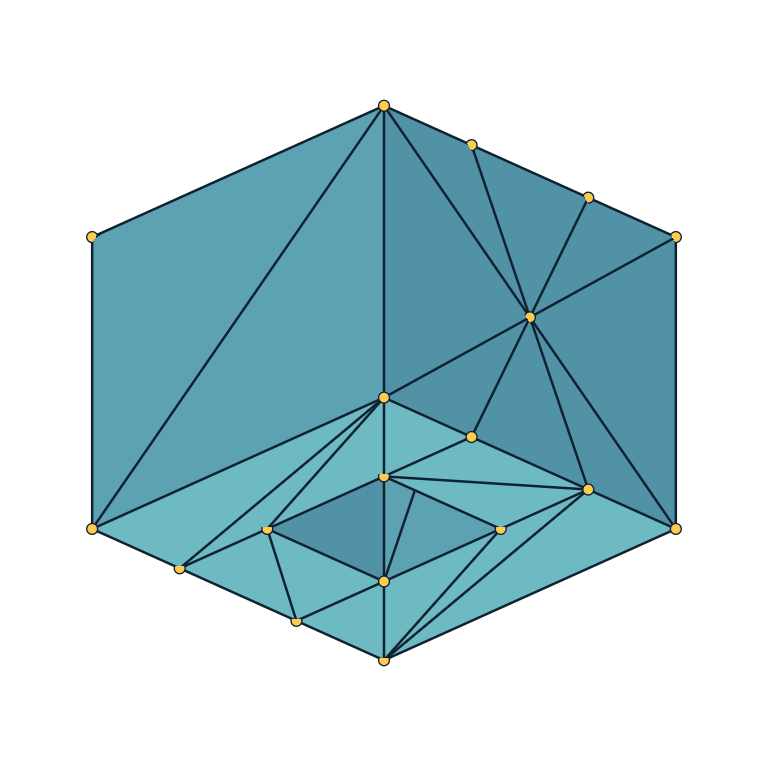

# CSGRS

CSGRS is the constructive-solid-geometry language of the Hyper geometry
workspace. It gives Rust programs an OpenSCAD-like vocabulary for profiles,
primitives, Boolean composition, transforms, extrusion, revolution, sweep,
loft, mesh conversion, and common CAD file formats.

It is intentionally a thin composition layer:

- [Hypercurve](../hypercurve/README.md) owns planar curves, regions, paths,
  profile topology, and certified 2D operations.
- [Hypermesh](../hypermesh/README.md) owns triangle-mesh topology, certified
  3D Booleans, hulls, and mesh predicates.
- [Hypertri](../hypertri/README.md) owns polygon and profile triangulation.
- [Hyperphysics](../hyperphysics/README.md) owns exact-aware physical-property
  calculations.
- CSGRS owns the modeling grammar that connects those kernels, restores
  per-face metadata, and adapts their carriers to formats and applications.

This boundary matters: CSGRS does not maintain a second curve kernel or mesh
Boolean implementation. `Profile` delegates its topology to Hypercurve, and
`Mesh<M>` lowers Boolean work to Hypermesh.

Core geometry uses `hyperreal::Real`. Primitive floats appear only at explicit
I/O, rendering, JavaScript, FFI, and adapter boundaries. The crate is pure Rust
and supports native and WebAssembly builds.



## What CSGRS owns

The usual modeling flow is:

```text
Hypercurve topology
       │
       ▼
Profile ── extrude / revolve / sweep / loft ──► Mesh<M>
   │                                                │
   ├─ 2D Booleans, offsets, SVG, Gerber             ├─ 3D Booleans via Hypermesh
   └─ paths, regions, triangulation                  ├─ queries via Hyper crates
                                                    └─ STL/OBJ/PLY/AMF/glTF/DXF
```

Use Hypercurve directly when an application primarily edits curves or needs
its lower-level certified topology reports. Use Hypermesh directly when an
application already has indexed triangles and only needs topology or Boolean
operations. Use CSGRS when the job is to describe and compose parts.

## Primary types

- `Real` is the exact-aware scalar re-exported from Hyperreal.
- `Profile` is a 2D model backed by `hypercurve::CurveRegion2`,
  `CurveString2`, and `CurvePath2`. It can contain filled material, holes,
  open wires, and higher-order paths.
- `Mesh<M>` is a triangle-mesh solid whose triangles carry metadata `M`.
  `Mesh<()>` is the convenient metadata-free form.
- `Triangle<M>` and `Vertex` are CSGRS's face and vertex carriers.
- `PolygonMesh<M>` is the optional planar-polygon carrier. Conversion to
  `Mesh<M>` is explicit.
- `CSG` supplies shared transforms, distribution helpers, and compatibility
  Boolean methods. Prefer the typed `try_*` Boolean methods on `Profile` and
  `Mesh<M>` when errors or uncertainty must be handled.
- `Triangulated3D`, `IndexedTriangulated3D`, and `IndexedTriangleMesh3D`
  provide common exporter and adapter views.

`Mesh<M>` metadata belongs to individual triangles, not the whole mesh.
Hypermesh provenance is used to restore source metadata after Booleans.

## Quick start

Install Rust with [rustup](https://rustup.rs/), then create a project:

```sh
cargo new drilled-cube
cd drilled-cube
cargo add csgrs
```

The equivalent manifest entry is:

```toml
[dependencies]
csgrs = "0.23.0"
```

Replace `src/main.rs` with:

<!-- quickstart:start -->
```rust
use csgrs::{Real, csg::CSG, mesh::Mesh, profile::Profile};

fn main() -> Result<(), Box<dyn std::error::Error>> {
    let body = Mesh::cube(Real::from(12), ());
    let opening = Profile::square(Real::from(4))
        .extrude(Real::from(16), ())
        .translate(Real::from(4), Real::from(4), Real::from(-2));

    let part = body.try_difference(&opening)?;
    assert!(part.is_manifold());
    std::fs::write("drilled_cube.stl", part.to_stl_binary("drilled_cube")?)?;
    Ok(())
}
```
<!-- quickstart:end -->

Run it with:

```sh
cargo run
```

The repository carries the same program as `examples/basic.rs`:

```sh
cargo run --example basic
```

It writes `drilled_cube.stl`.

## Useful API

The lists below cover the useful public modeling surface. Detailed signatures,
error payloads, and feature conditions are in the generated Rust API
documentation.

### Profiles and 2D topology

Construct common profiles with:

- rectangles and polygons: `rectangle`, `square`, `right_triangle`, `polygon`,
  `polygon_points`, `trapezoid`, `rounded_rectangle`;
- radial and rounded shapes: `circle`, `ellipse`, `regular_ngon`, `ring`,
  `pie_slice`, `reuleaux`, `squircle`, `keyhole`;
- decorative and parametric shapes: `star`, `heart`, `crescent`, `teardrop`,
  `egg`, `supershape`, `arrow`;
- mechanical shapes: `circle_with_keyway`, `circle_with_flat`,
  `circle_with_two_flats`, `involute_gear`, `cycloidal_gear`,
  `involute_rack`, `cycloidal_rack`, `airfoil_naca4`;
- sampled curve helpers: `bezier`, `bspline`, and `hilbert_curve`.

Construct without flattening Hypercurve topology using `from_curve_region`,
`from_curve_region_and_wires`, `from_curve_region_and_paths`,
`from_curve_topology`, `from_wires`, `from_wire`, `from_curve_paths`, and
`from_curve_path`.

Inspect or transfer that topology with `native_contours`, `wires`,
`curve_paths`, `into_curve_topology`, `region_profiles`,
`project_region_profiles`, `wire_polylines`, `material_contour_count`,
`hole_contour_count`, `contains_xy`, `is_empty`, and `triangulate`.

Perform 2D CSG with `try_union`, `try_difference`, `try_intersection`, and
`try_xor`. Offset and skeleton entry points are `try_offset`,
`try_offset_with_certified_segmentation`, `try_offset_rounded`,
`straight_skeleton_result`, and `try_straight_skeleton`. Compatibility methods
without `try_` may panic or discard structured failure information.

### Profile-to-solid operations

- `extrude(height, metadata)` creates a straight +Z extrusion.
- `extrude_vector(direction, metadata)` extrudes along a 3D vector.
- `extrude_twisted(height, twist, scale, slices, metadata)` creates connected
  twisted and tapered sections.
- `revolve(angle_degrees, segments, metadata)` revolves around the Y axis.
- `sweep(path, metadata)` carries a profile along a 3D point path.
- `loft(sections)` joins corresponding closed polygon sections.
- `Mesh::from_profile(profile, metadata)` triangulates a profile into a
  zero-thickness mesh carrier when that explicit conversion is needed.

These are CSGRS grammar operations: they consume Hypercurve-backed profiles,
construct faces, and return `Mesh<M>` for downstream Hypermesh operations.

### Mesh construction

Use `Mesh::empty`, `from_triangles`, or `from_indexed_triangles` for existing
geometry. Built-in solid constructors include:

- `cube`, `cuboid`, `sphere`, `cylinder`, `frustum`, `frustum_ptp`;
- `polyhedron`, `octahedron`, `icosahedron`, `torus`, `ellipsoid`;
- `egg`, `teardrop`, `teardrop_cylinder`, and `arrow`;
- `spur_gear_involute`, `spur_gear_cycloid`, and
  `helical_involute_gear`;
- feature-gated `metaballs`, `sdf`, `sdf_expr`, `gyroid_solid`,
  `schwarz_p_solid`, and `schwarz_d_solid`.

Segment, stack, slice, and resolution arguments control tessellation; they do
not introduce a global tolerance.

### 3D Booleans and transforms

Use `Mesh::try_union`, `try_difference`, `try_intersection`, and `try_xor`.
Each call immediately delegates one operation to Hypermesh and materializes
the certified result. The `CSG` trait's `union`, `difference`, `intersection`,
and `xor` methods are compatibility conveniences that panic on a failed
certificate.

The `CSG` trait also provides `transform`, `translate`, `translate_vector`,
`rotate`, `scale`, `mirror`, `center`, `float`, `inverse`,
`distribute_arc`, `distribute_linear`, and `distribute_grid`.
`union_distributed` combines an existing set of transformed copies.

### Mesh topology, queries, and refinement

- access: `triangles`, `into_triangles`, `vertices`, `vertex_iter`,
  `vertex_count`, `topology_counts`;
- topology: `connectivity`, `connectivity_counts`, `is_manifold`,
  `triangulate`, `renormalize`;
- subdivision and smoothing: `subdivide_triangles`,
  `subdivide_triangles_mut`, `laplacian_smooth`, `taubin_smooth`;
- construction algorithms: `convex_hull`, `minkowski_sum`;
- projections: `slice` and `flatten`, both returning `Profile`;
- queries: `bounding_box`, `contains_vertex`, `ray_intersections`,
  `intersect_polyline`, and `dihedral_angle`;
- physical properties: `mass_properties`, `exact_mass_properties`, and
  `to_hyperphysics_closed_triangle_mesh`;
- output views: `build_graphics_mesh`, `try_get_vertices_and_indices`,
  `try_to_gpu_mesh_f32`, `try_to_gpu_mesh_f64`;
- Hypermesh handoff: `to_hypermesh_buffers`, `to_hypermesh_exact`,
  `to_hypermesh_triangle_mesh`, and `try_certify_convex`;
- metadata: `filter_polygons_by_metadata`, `with_metadata`, and
  `map_metadata`.

The `*_or_zero` GPU helpers are lossy compatibility paths. Prefer the `try_*`
forms when failed finite projection must remain visible.

### File formats

Feature-gated I/O is grouped under `csgrs::io`:

- STL: `to_stl_ascii`, `to_stl_binary`, `from_stl`;
- OBJ: `to_obj`, `write_obj`, `from_obj`;
- PLY: `to_ply`, `write_ply`;
- AMF: `to_amf`, `to_amf_with_color`, `write_amf`;
- glTF/GLB: `to_gltf`, `write_gltf`, `from_gltf`, `GltfSceneObject`,
  `to_gltf_scene`, `write_gltf_scene`;
- VRML 2.0: `from_vrml`;
- DXF: `to_dxf`, `from_dxf`;
- SVG profiles: the `FromSVG` and `ToSVG` traits;
- Gerber profiles: the `FromGerber` and `ToGerber` traits plus
  `GerberExportOptions`.

Writers accepting `Triangulated3D` or `IndexedTriangulated3D` can serialize
compatible carriers without constructing a throwaway `Mesh`.

### Text, raster, implicit geometry, and adapters

- `Profile::text` consumes TrueType outlines with `truetype-text`.
- `Profile::from_hershey` creates open Hershey stroke geometry.
- `Profile::try_from_image` returns exact integer-grid contour work and a
  `RasterTraceReport`; `from_image` is the compatibility wrapper.
- `Profile::metaballs`, `Mesh::metaballs`, and `Mesh::sdf*` construct implicit
  geometry at explicitly chosen resolutions.
- `to_bevy_mesh` is available through `bevymesh`.
- The `wasm` feature exposes JavaScript-facing point, vector, plane, profile,
  mesh, and matrix wrappers.
- `adapter::{RawReal, F32, F64, I128}` selects a Rust boundary scalar policy;
  `adapter::Mesh` and `adapter::Profile` forward construction, transforms,
  Booleans, bounds, projection, and profile-to-solid operations to the exact
  core.
- `adapter::{GraphicsMesh, IndexedMeshBuffers, RegionProfile, Aabb3}` converts
  explicit result carriers at API egress. Float output is lossy and fallible;
  integer output requires an exact in-range integer.
- Language wrappers live in [bindings](bindings/README.md); the C ABI and
  native packaging layer is the separate
  [`csgrs-ffi`](https://github.com/timschmidt/csgrs-ffi) crate.

The primitive facade is namespaced so exact and boundary types cannot be
confused:

```rust
use csgrs::adapter::{F64, Mesh};

fn main() -> Result<(), csgrs::adapter::AdapterError> {
    let cube = Mesh::<F64, ()>::cube(2.0, ())?;
    let shifted = cube.translate(1.0, 0.0, 0.0)?;
    assert_eq!(shifted.bounding_box()?.maxs, [3.0, 2.0, 2.0]);
    Ok(())
}
```

Run the complete example with `cargo run --example scalar_adapter`.

## Features

Default features provide the common mesh/profile modeling experience and most
file formats. Applications with tight compile-time or platform requirements
should disable defaults and select only what they use.

| Feature | Adds |
|---|---|
| `mesh`, `polygon-mesh`, `sketch` | compatibility feature names for core mesh, polygon, and profile surfaces |
| `stl-io`, `obj-io`, `ply-io`, `amf-io` | mesh import/export families |
| `gltf-io`, `vrml-io`, `dxf-io` | scene and CAD exchange |
| `svg-io`, `gerber-io` | Hypercurve-backed profile exchange |
| `offset` | regularized offset/skeleton compatibility paths beyond certified simple sharp offsets |
| `truetype-text`, `hershey-text`, `image-io` | profile construction from fonts and rasters |
| `metaballs`, `sdf` | implicit sampling and Surface Nets output |
| `parallel` | Rayon-backed independent work |
| `bevymesh` | Bevy mesh conversion |
| `wasm` | JavaScript/WebAssembly bindings and required serializers |
| `dispatch-trace` | Hyper computation-path evidence for tests and benchmarks |

For a minimal profile-and-mesh build:

```toml
[dependencies]
csgrs = { version = "0.23.0", default-features = false, features = ["mesh", "sketch"] }
```

For WebAssembly:

```sh
cargo install wasm-pack
wasm-pack build --release --target bundler --out-dir pkg -- --features wasm
```

## Guarantees and boundaries

- Topology-sensitive scalar decisions use `Real` and the Hyper predicate
  stack. There is no global epsilon or precision feature.
- Sampled circles, text, images, SDFs, and display buffers remain
  approximations at caller-visible resolutions even when later topology
  decisions are exact-aware.
- Profile Booleans and topology are Hypercurve operations. Mesh Booleans,
  hulls, and topology certificates are Hypermesh operations.
- Boolean inputs must satisfy the documented closed, finite, oriented mesh
  preconditions. Prefer `try_*` operations and retain their structured errors.
- `Profile` carries geometry only. `Mesh<M>` carries one cloned metadata value
  per triangle; new, unrelated faces require explicit metadata.
- `PolygonMesh<M>` preserves planar polygon faces but is not a second Boolean
  kernel. Call `triangulate` to obtain `Mesh<M>`.
- Bevy, WebAssembly, primitive-scalar, FFI, and serialization surfaces are
  adapters. Their finite numeric projections do not become topology truth.
- `voxels` currently exposes no executable public modeling operation.

## Performance and hard tests

The reproducible harness, raw CSV schema, native dependency policy, and result
interpretation rules live in [benchmarks/README.md](benchmarks/README.md).
Optimization history and retained measurements live in
[PERFORMANCE.md](PERFORMANCE.md); they are not duplicated here as timeless
claims.

The current benchmark structure compares:

- CSGRS, CGAL EPECK, and tight-tolerance OpenCascade across 54 portable
  construction, transform, Boolean, analysis, and I/O workloads;
- CSGRS, `boolmesh`, and `manifold-rust` on shared Rust Boolean corpora;
- `tri-mesh` on carrier import and topology validation;
- CSGRS-specific profile, extrusion/revolution/sweep/loft, implicit, adapter,
  and format pipelines.

The original public-domain YeahRight control mesh remains a hard gate at both
layers. Its 5,687 vertices, 5,845 source polygons, and 11,894 fan triangles
must pass an always-on exact carrier/import test through CSGRS and Hypermesh:

```sh
cargo test --release --test competitive \
  full_resolution_yeahright_reaches_the_csgrs_and_hypermesh_carriers -- --nocapture
```

Both repositories also retain an ignored rotated-copy full-resolution
intersection. It is a real memory-ceiling test, not a routine CI test: a prior
CSGRS run reached about 116 GiB RSS before termination. The smaller
4,512-triangle Boolean hull is the portable high-resolution comparison row.

Run the serialized Rust comparison with:

```sh
cargo test --test competitive
cargo bench --bench competitive
```

Run the complete serialized cross-kernel matrix with:

```sh
benchmarks/run.sh
```

## Examples

The `examples` directory includes primitives, the primitive-scalar facade,
profile extrusion, 2D shapes and offsets, Booleans, transformations, convex
hull, Minkowski sum, multi-format export, adjacency inspection, and README
render generation. The WebAssembly Nuxt demo is documented separately in
[examples/wasm-nuxt4](examples/wasm-nuxt4/README.md).

Community integrations include:

- [csgrs-bevy-example](https://github.com/timschmidt/csgrs-bevy-example)
- [csgrs-egui-example](https://github.com/timschmidt/csgrs-egui-example)
- [csgrs-egui-wasm-example](https://github.com/timschmidt/csgrs-egui-wasm-example)
- [csgrs-druid-example](https://github.com/timschmidt/csgrs-druid-example)

## References

These sources define the mathematical and interchange boundaries used by the
crate:

- Nicholas M. Patrikalakis, Takashi Maekawa, and Wonjoon Cho,
  [*Shape Interrogation for Computer Aided Design and Manufacturing*](https://web.mit.edu/hyperbook/Patrikalakis-Maekawa-Cho/),
  MIT Press. The curve/surface, intersection, robustness, and offset chapters
  motivate keeping representation, interrogation, and presentation layers
  distinct.
- Jonathan Richard Shewchuk,
  [“Adaptive Precision Floating-Point Arithmetic and Fast Robust Geometric Predicates”](https://www.cs.cmu.edu/~quake/robust.html),
  *Discrete & Computational Geometry* 18, 1997, pp. 305–363. This is the
  primary reference for sign-correct adaptive geometric predicates.
- Chee K. Yap,
  [“Towards Exact Geometric Computation”](https://doi.org/10.1016/0925-7721(95)00040-2),
  *Computational Geometry* 7, 1997, pp. 3–23. This informs the separation
  between exact decisions and explicit approximation boundaries.
- Ucamco,
  [Gerber Layer Format specification downloads](https://www.ucamco.com/en/gerber/downloads).
  This is the normative source used by the Gerber adapter.
- W3C,
  [Scalable Vector Graphics (SVG) 2](https://www.w3.org/TR/SVG2/).
  Hypercurve owns SVG geometry parsing and serialization; CSGRS adapts the
  resulting topology.
- Khronos Group,
  [glTF 2.0 specification](https://registry.khronos.org/glTF/specs/2.0/glTF-2.0.html).
  This defines the scene and buffer format used by the glTF adapter.
- Keenan Crane,
  [YeahRight model and public-domain corpus provenance](benchmarks/data/yeahright/README.md).
  The unchanged full-resolution control mesh supplies the two-level hard
  carrier gate and explicit memory-ceiling Boolean.

## Acknowledgements

CSGRS began as a Rust translation of Evan Wallace's
[CSG.js](https://github.com/evanw/csg.js), released under the MIT license.
That lineage and copyright notice remain in [LICENSE](LICENSE).

The geometry stack also depends on the substantial work of the Hyperreal,
Hyperlattice, Hyperlimit, Hypercurve, Hypertri, Hypermesh, Hyperphysics, and
Hypersdf contributors and on the upstream format and rendering crates named in
`Cargo.toml`. Keenan Crane placed the YeahRight benchmark meshes in the public
domain; their original statement is preserved with the fixtures.

## Community and contributing

Discussion is available in the
[CSGRS Discord community](https://discord.gg/9WkD3WFxMC). Bug reports and pull
requests are welcome in the
[GitHub repository](https://github.com/timschmidt/csgrs).

Before submitting changes, run:

```sh
cargo fmt --all -- --check
cargo test --all-features
cargo test --all-features --examples
cargo clippy --all-features --all-targets -- -D warnings
RUSTDOCFLAGS="-D warnings" cargo doc --all-features --no-deps
cargo check --all-features --benches
```

## License

CSGRS is available under the [MIT License](LICENSE).
